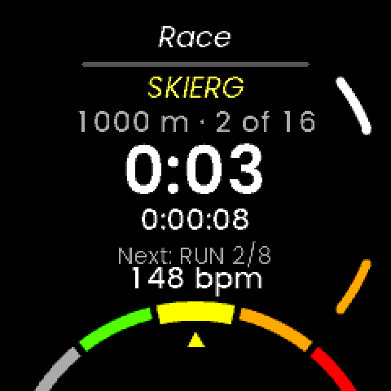

# HybridX Race

A HYROX-format race timer for the [UNA Watch](https://unawatch.com).

One button per split. Every run and every station is recorded as its own lap, so
the race arrives in Strava or Garmin Connect as sixteen splits rather than one
undifferentiated 90-minute blob.

- **Formats:** full race, or either half (rounds 1–4 / 5–8), with real round
  numbers in both.
- **Roxzone:** off by default; turn it on and each station is wrapped by a
  Roxzone-in and Roxzone-out lap (31 segments instead of 16).
- **Run length:** 1 km is the race, but a sim can be run at anything from 100 m
  to 1 km in 100 m steps. Shorten it and the app calls the session a sim.
- **Split lock:** a configurable 1–10 s window after each split, so a fumbled
  double press at the SkiErg cannot cost you a segment.
- **Undo:** the last split, or the finish, can be taken back without disturbing
  the times either side of it.
- **Heart rate** per segment, average and maximum, from the watch or a strap.

Status: **v0.1.0, unreleased.** Phases 0–5 of the build brief are complete.
Nothing has yet run on a watch — see
[`hybridx-race/docs/ON_WATCH_TESTS.md`](hybridx-race/docs/ON_WATCH_TESTS.md).



## The four buttons

| | Main menu | Race | Action menu | Finished | Summary |
|---|---|---|---|---|---|
| **L1** | Previous item | Change face | Up | | Page up |
| **L2** | Next item | Change face | Down | Undo finish | Page down |
| **R1** | Select | Open action menu | Select | Save | |
| **R2** | Exit app | **Split** | Close menu | | Exit |

The race clock keeps running while the action menu is open, and no screen during
a race ever exits the app on idle.

## Repository layout

```
CLAUDE.md                       standing rules for this project
hybridx-race/
  Resources/                    icons, app-manifest.json, store previews
  Software/
    Libs/                       RaceModel (pure C++), Service, FIT writing
    Apps/HybridXRace-CMake/     the watch build
    Apps/LVGL-GUI/              the GUI process, and its PC simulator
  Tests/Host/                   78 GoogleTest cases, no watch needed
  Utilities/pack-store-zip.sh   builds the portal upload package
  docs/                         the brief, NOTES, ARCHITECTURE, screenshots
una-sdk/                        the UNA Watch SDK (not committed; see below)
```

`una-sdk/` is an external, read-only clone. It is never committed here and is
never edited.

## Getting set up

You need this once. Each step is separate — do them in order.

**1. Clone the SDK next to `hybridx-race/`, with its submodules.** LVGL is a
submodule; without `--recurse-submodules` the GUI will not build.

```bash
git clone --recurse-submodules https://github.com/UNAWatch/una-sdk.git
cd una-sdk && git checkout a7a995a1 && git submodule update --init --recursive
```

`a7a995a1` (`apps-v1.5.0-rc4-8-ga7a995a1`) is the commit this app is built and
tested against. The SDK ABI it carries is 3, which means the watch needs kernel
firmware **1.4.0 or newer**.

**2. Point `UNA_SDK` at it.** Every build reads this.

```bash
export UNA_SDK=/absolute/path/to/una-sdk     # add it to your shell profile
```

**3. Install the ARM toolchain — ST's, not your distribution's.** Install
STM32CubeCLT (or STM32CubeIDE) and make sure its `arm-none-eabi-gcc` is the one
on your `PATH`.

> This one matters. A distribution `arm-none-eabi-gcc` **does not link** against
> this SDK: the kernel's linker script discards `libc.a` and resolves libc
> through addresses the kernel provides, but exports no syscall stubs, so the
> link fails on `_write`, `_close`, `_read` and `_lseek`. There is a workaround
> in `hybridx-race/docs/experiments/syscall_stubs.c` that was used to get the
> build going in a container — it is **not** safe for a watch. See
> `NOTES.md` 0.4 and `ON_WATCH_TESTS.md` W1.

**4. For the simulator and the tests** you need CMake 3.21+, a host C++17
compiler and SDL2. Nothing ARM.

## Building

**For the watch.** Produces `hybridx-race/Output/HybridXRace_<version>.uapp`.

```bash
cmake -G "Unix Makefiles" -S hybridx-race/Software/Apps/HybridXRace-CMake -B hybridx-race/build
cmake --build hybridx-race/build
```

**The host tests.** These cover the race logic — the state machine, the timing,
the clock wrap, the undo accounting — and need neither a watch nor the ARM
toolchain. Run them after every change.

```bash
cmake -S hybridx-race/Tests/Host -B hybridx-race/build-tests -DCMAKE_BUILD_TYPE=Debug
cmake --build hybridx-race/build-tests -j4
ctest --test-dir hybridx-race/build-tests --output-on-failure
```

**The simulator.** The whole app, including the service, on your PC.

```bash
cmake -S hybridx-race/Software/Apps/LVGL-GUI/simulator -B hybridx-race/Software/Apps/LVGL-GUI/simulator/build
cmake --build hybridx-race/Software/Apps/LVGL-GUI/simulator/build
./hybridx-race/Software/Apps/LVGL-GUI/simulator/build/bin/HybridXRaceSimulator
```

Keys **1 2 3 4** are buttons L1, L2, R1, R2.

Build the watch target and the simulator after every change: their source lists
are maintained separately, so a file added to one can be missing from the other
and nothing will tell you until the other build breaks.

**Screenshots.** The simulator has no capture of its own, so this drives it from
outside (needs `Xvfb`, `xdotool` and ImageMagick):

```bash
hybridx-race/docs/experiments/capture_screens.sh
```

## Installing on a watch

**Only install a `.uapp` built by GitHub**, never one built in a container with
Ubuntu's compiler (see step 3 of "Getting set up"). Every push runs the
**Watch builds** workflow, which builds the apps exactly the way UNA's own CI
builds its apps, with ST's toolchain. To download the result:

1. On GitHub, open the repository and choose the **Actions** tab.
2. Pick the newest **Watch builds** run with a green tick on your branch.
3. At the bottom of the run page, under **Artifacts**, download **watch-apps**.
   It is a zip holding one `.uapp` per app: HybridX Race, plus HybridX
   Streak's app, glance and probe (see `hybridx-streak/docs/PROBE.md`).

Until the app is on the store, installing is a file copy:

1. Connect the watch by USB and wait for mass storage to appear. It can take a
   while — running apps flush their data first.
2. Create `Apps/HybridXRace/` on the watch and copy the `.uapp` into it.
3. Eject the drive **safely**, then unplug.
4. Power-cycle the watch.
5. Top right button, and the app is in the list.

If it is not there, compare the file's hash with the one you copied. Deeper
faults need the debug UART and UNA's Dev tool.

## Building the store package

```bash
hybridx-race/Utilities/pack-store-zip.sh
```

It reads the version out of the built `.uapp` so the manifest can never describe
a binary it does not contain, stamps `minKernelVersion` from the SDK's ABI, runs
both SDK validators — including the one that checks `app-manifest.json` against
the C++ field table — and only then writes
`hybridx-race/Output/HybridXRace-<version>.zip`.

> **Before the first real upload:** the `APP_ID` in `CMakeLists.txt` and
> `app-manifest.json` is a locally generated development ID. Create the app on
> [apps.unawatch.com](https://apps.unawatch.com), paste the App ID it issues into
> both files, re-run CMake, rebuild, and re-run the packaging script. The mobile
> app matches versions by that ID.

## Versions

`BUILD_VERSION` comes from git tags, and the SDK's version script matches
`apps-v*` — a plain `v0.1.0` tag is **not** picked up and the build stays
`0.0.0-dev`. Tag both:

```bash
git tag v0.1.0 && git tag apps-v0.1.0 && git push --tags
```

Then rebuild and run the packaging script with `--expect-version 0.1.0`, which
refuses to package if the binary is not actually that version.

## Where everything is written down

| | |
|---|---|
| [`docs/HYBRIDX_RACE_BRIEF.md`](hybridx-race/docs/HYBRIDX_RACE_BRIEF.md) | the specification this is built to |
| [`docs/ARCHITECTURE.md`](hybridx-race/docs/ARCHITECTURE.md) | how the app is put together, and why |
| [`docs/NOTES.md`](hybridx-race/docs/NOTES.md) | the running log: findings, measurements, decisions, and every place the SDK and the brief disagree |
| [`docs/ON_WATCH_TESTS.md`](hybridx-race/docs/ON_WATCH_TESTS.md) | everything that still needs real hardware |
| [`docs/ROADMAP.md`](hybridx-race/docs/ROADMAP.md) | what's next past v0.1.0, and what's already scoped versus just proposed |
| [`docs/experiments/`](hybridx-race/docs/experiments/) | the throwaway programs that answered a question, kept because they are the evidence |
| [`CHANGELOG.md`](CHANGELOG.md) | what changed, per release |

## Licence

MIT — see [`LICENSE`](LICENSE). Third-party components and the redistributed
Poppins-derived fonts keep their own terms; see
[`THIRD-PARTY-LICENSES.md`](THIRD-PARTY-LICENSES.md).
