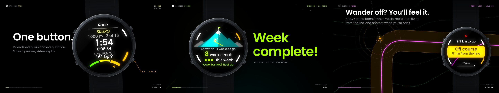

# HybridX promo films

Three 150-second motion-graphics films, one per app, made to be seen together:
the same brand, the same grammar, a different character each.



| Film | File | Character |
|---|---|---|
| **HybridX Race**, "Sixteen" | [`videos/hybridx-race.mp4`](videos/hybridx-race.mp4) | 128 BPM, F minor. The film is itself a race: sixteen chapters, cyan for runs, lemon for stations, a split on every cut. |
| **HybridX Streak**, "The climb" | [`videos/hybridx-streak.mp4`](videos/hybridx-streak.mp4) | 112 BPM, D major. Night sky, teal and lime. Everything moves upwards, and the weeks-climbed counter only ever goes up. |
| **HybridX Trail**, "Follow the line" | [`videos/hybridx-trail.mp4`](videos/hybridx-trail.mp4) | 96 BPM, E minor. A topographic map at night, one orchid line, and the one sharp moment: going off course. |

All three are 1920 × 1080 at 60 fps, H.264 with 48 kHz AAC, mastered to
−14 LUFS. Stills from each are in [`videos/posters/`](videos/posters/).

## What they share

- **Jon's X mark**, rebuilt as vector geometry (`lib/brand.mjs`) and fitted to
  `hybridx-race/Resources/icon_60x60.png` (97% overlap at icon size): a ">"
  chevron with a flat tip, and two arms that stop short of it. **The gap is
  where each app's colour lives**: the title sting sparks it, the end card
  lets it breathe.
- **Only the watch's colours.** Every accent is from the SDK's 64-colour
  palette (`una-sdk/Libs/Header/SDK/GUI/Color.hpp`) as the display shows it:
  Race's CYAN and LEMON, Streak's TEAL and LIME, Trail's ORCHID.
- **Type:** Poppins, the apps' own face, for everything big; JetBrains Mono for
  small technical labels.
- **The grammar:** the same title sting, the same HUD in the corners, the same
  end card with the family of three and the one being shown lit, and the same
  sonic logo (two notes a fifth apart as the arms lock, then the octave). Each
  film has its own transition built from the brand: Race wipes with the
  chevron pointing forward, Streak with it pointing up, Trail with a drawn line.
- **The real screens.** Race and Streak's watch screens are redrawn from the
  apps' layout code (label positions, LVGL font metrics, the SDK's button
  arcs, title rule and wheel menu, the Summit scene's mountain geometry), and
  checked against the committed simulator captures.

## Read before sharing

- **Race times are an example race** (a 1:15:28 finish), invented for the film.
  They are not pacing data and nothing in the app uses them.
- **Trail is at its T0 probe.** Its screens here are concept designs for the
  brief's v1 features (route list, map, zoom, heading-up, the off-course
  banner, distance along the line); the real screens are phase T3. Its end
  card says "Coming soon". The GPX numbers (5,001 points, 1,001 kept 10 m
  apart, 10.05 km, 80 m ascent) are the probe's simulator run on the test
  loop from `Tools/TestRoutes/make_test_gpx.py`.
- **Trademarks.** UNA appears only as "for UNA Watch", the nominative use the
  SDK's `TRADEMARK.md` allows; there is no UNA logo, and the watch drawn is a
  generic round watch, not UNA's product. HYROX is not named. Strava, Garmin
  Connect, OS Maps and Komoot are named in plain text, as the apps' docs do.
- **The address** on the end card, `hybridx.club`, comes from the wordmark
  lockup in Jon's brand files. Change it in `lib/brand.mjs` if it's wrong.

## Rendering

Frames are pure functions of time, drawn with Skia (`@napi-rs/canvas`) and
piped to ffmpeg; the soundtracks are synthesised from oscillators and noise
with numpy and scipy, and placed from each film's own cue sheet, so every hit
lands on its frame.

You need Node 20+, Python 3 with `numpy` and `scipy`, and an ffmpeg with
libx264 (`pip install imageio-ffmpeg` provides one; or set `FFMPEG`).

```bash
cd promo
npm install
python3 audio/race.py            # writes audio/out/race.wav
node render.mjs race             # renders in parallel, muxes, writes videos/hybridx-race.mp4
```

Quicker looks while working:

```bash
node render.mjs race --sheet 2.5          # a contact sheet, one frame per 2.5 s
node render.mjs race --still 31,135       # full-size frames
node render.mjs race --from 20 --to 40 --preview   # a half-size clip
node render.mjs race --cues               # the cue sheet the score is built from
python3 audio/spectrum.py audio/out/race.wav        # the mix's octave balance
```

A full film renders in five to six minutes on four cores (H.264 at CRF 18).

## Where things are

```
render.mjs            the renderer: stills, sheets, parallel video, muxing
lib/core.mjs          frame constants, easing, springs, seeded noise, tempo
lib/gfx.mjs           type, kinetic text, layers, glow, shapes
lib/brand.mjs         palette, the X mark, sting, HUD, wipes, end card
lib/watch.mjs         the watch, its buttons, presses, haptic shake
lib/lvgl.mjs          240 x 240 screen primitives matching the SDK's LVGL helpers
lib/ui-race.mjs       Race's screens
lib/ui-streak.mjs     Streak's screens and the Summit scene
lib/ui-trail.mjs      Trail's concept screens
lib/terrain.mjs       Trail's height field, contours and route
lib/film.mjs          headline, callout and press helpers
films/*.mjs           the three films: scenes, timing, cue sheets
audio/synth.py        the synthesiser, effects and mix bus
audio/common.py       the sonic logo, split sound, loudness normalisation
audio/*.py            the three scores
videos/               the finished films and their posters
```

## Licences

Poppins and JetBrains Mono are under the SIL Open Font Licence and come from
the `@expo-google-fonts` npm packages. The soundtracks contain no samples.
